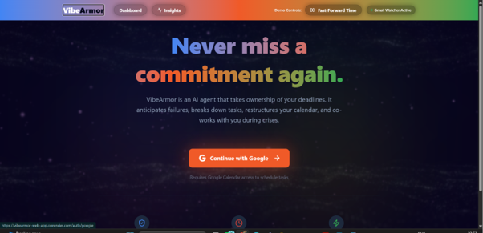
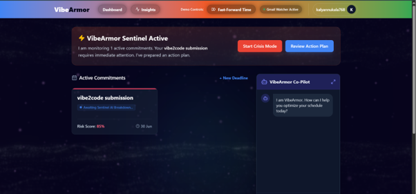
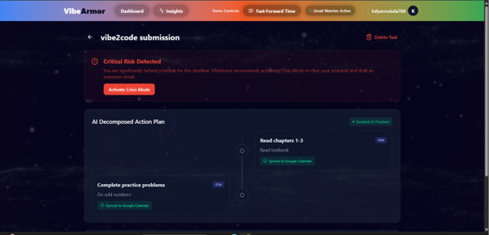
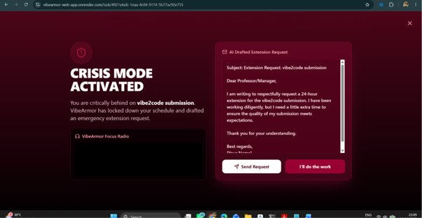
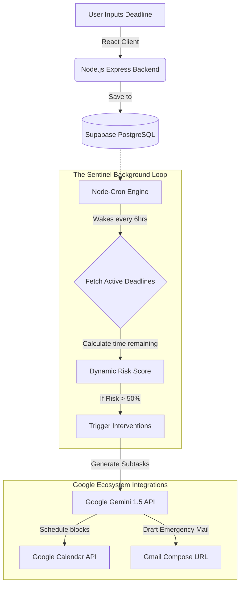

<div align="center">
  
  <h1>🛡️ VibeArmor</h1>
  <p><strong>Next-Generation Autonomous Deadline Intelligence Agent</strong></p>
  
  <p>
    <a href="https://vibearmor-web-app.onrender.com">Live Demo</a> •
    <a href="#-the-problem">The Problem</a> •
    <a href="#%EF%B8%8F-architecture--pipeline">Architecture</a> •
    <a href="#-technical-implementation">Technical Implementation</a>
  </p>
</div>

---

## 📸 Application Showcase

### Seamless Google OAuth Login

*Secure, 1-click Google OAuth 2.0 authentication granting the Sentinel necessary Calendar and Task permissions.*

### The Sentinel Dashboard

*The central command hub where the Sentinel monitors active deadlines, risk scores, and dynamically adjusts your calendar.*

### AI Deadline Decomposition & Risk Scoring

*Google Gemini breaks down massive projects into atomic subtasks and evaluates mathematical failure risk in real-time.*

### Crisis Mode (Screen Takeover)

*An aggressive, full-screen takeover activated when a deadline is mathematically at risk. Includes Lofi focus radio, locked-down navigation, and an AI-drafted extension email.*

### Google Calendar Sync

*The AI autonomously injects, color-codes, and updates time blocks directly in your native Google Calendar.*

---

## ⚙️ Architecture & Pipeline

VibeArmor is engineered with a continuous background loop that ensures autonomous operation even when the user is offline.



### The Sentinel Autonomous Flow:
1. **Ingestion**: User submits a final deadline via the React frontend.
2. **Decomposition**: The backend sends the deadline to **Google Gemini** using Structured JSON Outputs to break the project into 30-minute chunks.
3. **Continuous Monitoring**: The `node-cron` background agent checks Supabase every 6 hours.
4. **Intervention**: If time is running out (high risk score), the Sentinel uses securely stored OAuth refresh tokens to automatically inject the subtasks into the user's **Google Calendar**.
5. **Crisis Lockdown**: If the risk becomes critical, the UI triggers a React Portal screen-takeover ("Crisis Mode") and drafts an extension email via Gemini.

---

## 🌪 The Problem

Traditional productivity tools and calendars are fundamentally passive; they rely entirely on the user's discipline. They send a push notification, which is instantly dismissed, and then they give up. When a user's discipline fails—due to procrastination, burnout, or ADHD—the tool fails with them. 

There is a critical need for a system that doesn't just *remind* you to work, but actively **intervenes** to protect your deadlines. We need a shift from passive task management to **Autonomous Deadline Intelligence**.

---

## 🧠 Technical Implementation

VibeArmor is built using a modern, highly scalable full-stack architecture.

### Frontend (Product Experience & Design)
- **Framework:** React 19 + TypeScript + Vite
- **Styling:** We engineered a premium, dark-mode glassmorphism aesthetic using **Tailwind CSS v4**. 
- **Advanced UI Mechanics:** We utilized advanced CSS stacking contexts and **React Portals** to handle the complex, un-closable "Crisis Mode" screen takeovers, ensuring the user cannot navigate away.

### Backend (Technical Architecture)
- **Framework:** Node.js + Express + TypeScript
- **Database & Storage:** **Supabase (PostgreSQL)** handles persistent storage of users, complex task relationships, and behavioral patterns.
- **Background Cron Engine:** A decoupled `node-cron` background service acts as the "Sentinel," waking up continuously to evaluate mathematical risk scores and trigger Google Calendar mutations without the user needing to be online.
- **Real-Time Streaming:** Utilizes **Server-Sent Events (SSE)** for high-speed, typewriter-style token streaming from the AI models directly to the React frontend.

---

## ⚙️ Google Technologies Utilized

1. **Google Gemini API:** We utilized Gemini via the official `@google/generative-ai` SDK to power the core intelligence of the application. Gemini handles the complex JSON-structured task decomposition and dynamically generates emergency extension emails.
2. **Google Calendar API:** We engineered a flawless, two-way read/write integration. By securely storing refresh tokens, the Sentinel Agent can autonomously create, update, and color-code calendar blocks directly on the user's primary Google Calendar.
3. **Google Tasks API:** Fully integrated with Google Tasks to ensure subtasks and checklist items generated by the AI are perfectly synced.
4. **Google OAuth 2.0:** We implemented strict, secure Google authentication to manage user identities and safely request the precise permissions needed for Calendar and Task modifications.
5. **Google Gmail Compose Web Interface:** We integrated direct routing to Gmail's native web compose interface (`mail.google.com`), allowing the AI to seamlessly pass its drafted extension requests directly into the user's actual email client.

---

## 📂 Project Folder Structure

VibeArmor is engineered with a clean, decoupled monolithic architecture separating the React frontend from the Node.js backend:

```text
vibearmor-web-app/
│
├── client/                     # Frontend Application (React + Vite)
│   ├── src/
│   │   ├── components/         # Reusable UI components (Dashboard, CrisisMode, AgentChat)
│   │   ├── lib/                # API clients and utility functions
│   │   ├── App.tsx             # Main React Router configuration
│   │   ├── index.css           # Tailwind CSS directives
│   │   └── main.tsx            # React DOM entry point
│   ├── package.json
│   └── tailwind.config.js
│
├── server/                     # Backend Application (Node.js + Express)
│   ├── routes/                 # API endpoint definitions (auth, interventions, deadlines)
│   ├── services/               # Core business logic
│   │   ├── agentService.ts     # The Sentinel Background Cron Engine
│   │   ├── calendarService.ts  # Google Calendar API wrapper
│   │   ├── geminiService.ts    # Google Generative AI integration & streaming
│   │   └── supabaseClient.ts   # PostgreSQL Database connection
│   ├── index.ts                # Express server initialization
│   └── package.json
│
├── docs/                       # Project screenshots and assets
└── README.md
```

---

## 💻 Local Development Setup

VibeArmor uses a decoupled architecture. You will need two terminal windows to run it locally.

### 1. Start the Backend Server
```bash
cd server
npm install
npm run dev
```
*(Ensure you have created a `.env` file containing your `GEMINI_API_KEY`, `SUPABASE_URL`, and Google OAuth Credentials)*

### 2. Start the Frontend Client
```bash
cd client
npm install
npm run dev
```

Navigate to `http://localhost:5173` to interact with the Sentinel!
.*
